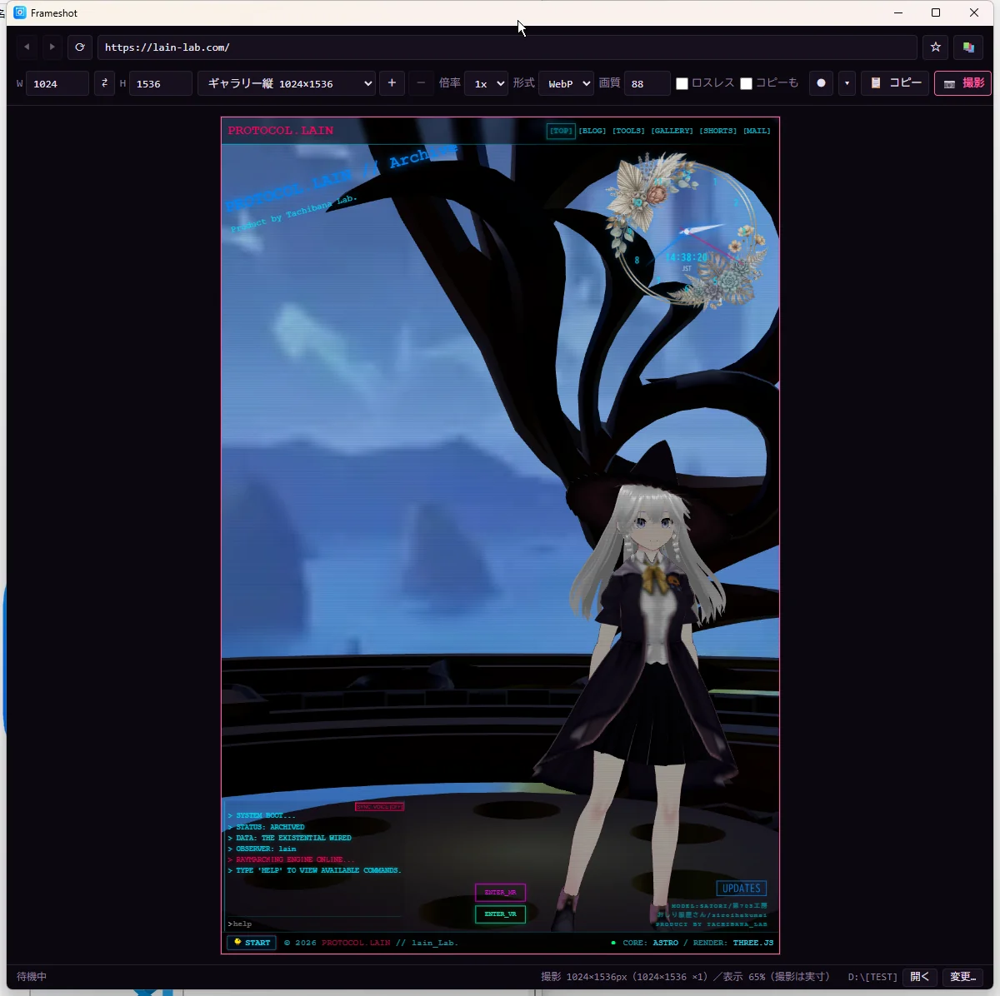
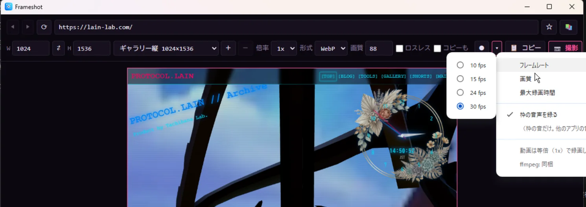
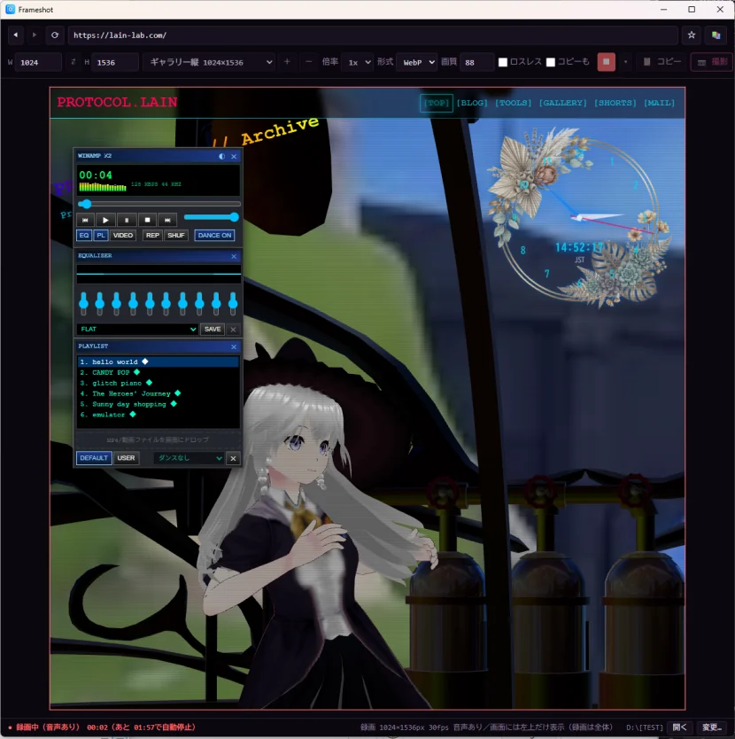
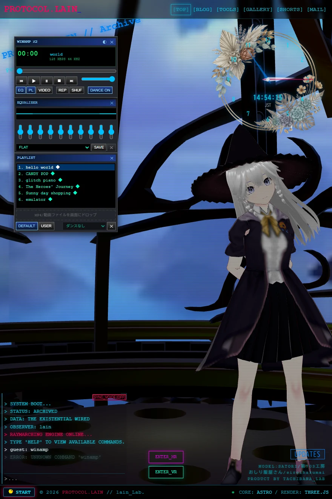

# Frameshot

固定サイズの枠の中に Web ページを表示して、静止画（PNG / JPG / WebP）と動画（MP4）をボタン一つで撮るデスクトップツール。

<p align="center">
  
</p>

- 外部サイトをそのまま枠に入れられる（iframe の埋め込み拒否に引っかからない）
- 画面より大きい枠でも、欠けずに実寸で撮れる（画面に入らないときは、表示だけ縮小）
- 解像度倍率 1x / 2x / 3x（静止画）、サイズプリセット（自分用の登録も可）、ブックマーク
- 動画は ⏺ で録画、⏹ で止めて MP4 に保存。枠が画面からはみ出していても、全体が録れる（動画は等倍のみ）
- 枠の音声も録れる（▾ →「枠の音声を録る」。既定は OFF）。システム全体の音ではなく、枠のページの音だけが入る

設計は [DESIGN.md](DESIGN.md) を参照。

## ダウンロード

[Releases](https://github.com/fixtan/Frameshot/releases/latest) から、どちらか一つ。

| ファイル | 内容 |
|---|---|
| `frameshot-x.y.z-setup.exe` | インストーラー |
| `frameshot-x.y.z-portable.exe` | インストール不要。置いた場所でそのまま動く |

| OS | 状況 |
|---|---|
| Windows | 動作確認済み（配布物あり） |
| macOS | Intel Mac で静止画・動画を確認（Apple Silicon 版は未確認）。署名なし。配布物は順次追加 |
| Linux | 仮想環境（Xvfb）でのみ確認。実機は未確認。配布物（AppImage / deb）は順次追加 |

**Windows の警告について:** コード署名をしていないので、初めて起動すると SmartScreen が「発行元不明」と出す。「詳細情報」→「実行」で起動できる。

## 使い方

1. URL バーにアドレスを入れて Enter
2. W × H（または「プリセット…」）で枠の大きさを決める
3. ページを撮りたい状態にして **📷 撮影**（静止画）、または **⏺**（録画。もう一度押すと停止して保存）
4. 動画のフレームレート・画質・最大録画時間・音声の ON/OFF は、⏺ の隣の ▾ から

<p align="center">
  
</p>

### 録画中の表示

録画中は、枠の見える範囲だけが画面に出る（表示は左上の切り抜き。**録画は枠の全体**）。録画中は、サイズ・倍率の変更と静止画の撮影はできない。

<p align="center">
  
</p>

### 撮れるもの

画面より大きい枠（例: 880×1320）でも、下まで欠けずに撮れる。

<p align="center">
  
</p>

### ショートカット

| 操作 | ショートカット |
|---|---|
| 撮影して保存 | Ctrl+Shift+S |
| クリップボードにコピー | Ctrl+Shift+C |
| 録画の開始 / 停止 | Ctrl+Shift+R |
| URL バーへ移動 | Ctrl+L |
| 再読み込み | F5 / Ctrl+R |
| 戻る・進む | Alt+← / Alt+→ |
| ページの開発者ツール | F12 |

保存先の既定は「ピクチャ/Frameshot」。ファイル名は `{host}_{date}_{time}_{w}x{h}`（静止画で倍率が 2x 以上なら末尾に `@2x`。動画は拡張子 `.mp4`）。設定とブックマークは、ユーザーデータのフォルダの `settings.json` に保存される。

## できないこと

- **DRM で保護された映像**（配信サービスなど）は、再生も撮影もできない。
- **2x / 3x の動画**は撮れない（動画は等倍のみ。静止画は 1x / 2x / 3x）。
- **システム全体の音**は録れない。録れるのは、枠のページの音だけ。
- **重いページの動画**（Three.js など描画が重いページ）は、PC の性能によってはカクつく。ページの描画と録画のエンコードを同じ PC で行うため。fps や枠のサイズを下げると軽くなる。
- **macOS では、枠がウィンドウに収まらない大きさだと録画を始められない**ことがある（静止画は問題ない）。ウィンドウを大きくするか、枠を小さくする。

## ソースから動かす

Node.js 22 以上が必要。

```powershell
npm install
npm start
```

## 開発

```powershell
npm run check          # 型の検査（JSDoc + tsc --noEmit）
npm test               # 単体テスト
npm run test:capture   # 実際の Chromium で静止画の撮影を検査（test/out/ に画像が出る）
npm run test:record    # 実際の Chromium と同梱の ffmpeg で録画を検査（test/out/ に動画が出る）
```

画面のない Linux では、`xvfb-run -a -s "-screen 0 1280x800x24" npx electron --no-sandbox test/capture.selftest.js`（録画は `test/record.selftest.js`）で検査できる。GPU のない環境でアプリを起動するときは、環境変数 `FRAMESHOT_SOFTWARE_GL=1` を付ける。

### ビルド

```powershell
npm run dist:win     # Windows（インストーラーとポータブル）
npm run dist:mac     # macOS
npm run dist:linux   # Linux
```

### 構成

```
src/main/      ウィンドウ・枠（WebContentsView）・撮影・録画・設定の保存
src/preload/   ツールバー UI への窓口
src/renderer/  ツールバー UI とスタートページ
src/shared/    設定・URL・ファイル名など、Electron に依存しない処理
test/          単体テストと撮影・録画の検査
```

## ライセンス

本体は [MIT](LICENSE)。動画の録画には、別プロセスとして FFmpeg（GPL ビルド）を同梱している。詳しくは [THIRD_PARTY_LICENSES.md](THIRD_PARTY_LICENSES.md)。同梱の FFmpeg ではなく自分のものを使うときは、`settings.json` の `ffmpegPath` に場所を書く。
